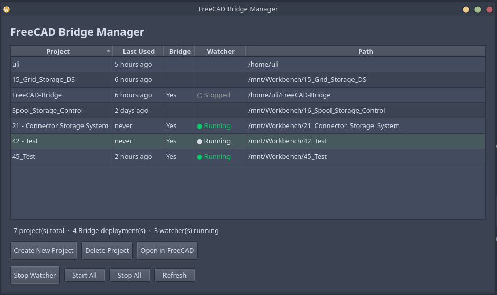
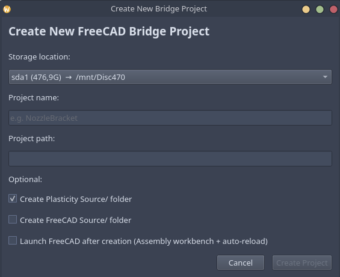

# Plasticity → FreeCAD Bridge

Automatically converts STEP files exported from **Plasticity 3D** to `.FCStd` files for **FreeCAD** and triggers assembly reload — so you can design in Plasticity and validate assemblies in FreeCAD without manual conversion.

## Why This Bridge

This project was inspired by the existing **Plasticity → Blender Bridge** (a bidirectional WebSocket addon for mesh/sculpt work). That bridge is excellent for **organic modeling, texturing, and rendering** — passing geometry back and forth between Plasticity and Blender in real time.

The **FreeCAD Bridge** serves a different purpose: **mechanical design and assembly validation**.

| | Plasticity → Blender Bridge | Plasticity → FreeCAD Bridge |
|---|---|---|
| **Direction** | Bidirectional (live WebSocket) | One-directional (file-based watcher) |
| **Data format** | Mesh (triangles via WebSocket) | NURBS (STEP file → FCStd) |
| **Purpose** | Sculpting, rendering, texturing | Assembly checking, fit analysis, engineering |
| **Connection** | Real-time at localhost:8980 | Polls a folder every 2 seconds |
| **Bidirectional?** | ✅ Send and receive geometry | ❌ Plasticity → FreeCAD only |
| **State** | Experimental (ZIP addon) | Production-ready (installed system-wide) |

> If you need to sculpt, texture, or render — use the Blender Bridge. If you need to check how parts fit together in an assembly — this FreeCAD Bridge is for you.

## Workflow

```
Plasticity (design) → Export STEP → Watcher converts to FCStd → FreeCAD reloads assembly
```

1. **Design a part in Plasticity 3D** and save it as `.step` into the project's `01 - Drop STEP Files Here/` folder
2. The **watcher** detects the new file, copies it to `03 - Version Backup/`, converts it to `.FCStd`, and places it in `02 - Converted FreeCAD Parts/`
3. The watcher writes a **trigger file** that tells the FreeCAD macro to reload the open assembly
4. In FreeCAD, the **Assembly workbench** reopens the assembly with the updated part — no manual import needed

### Folder structure

```
Project/
  Engine/                         ← Core scripts (watcher, converter, config, macro, GUI)
  01 - Drop STEP Files Here/      ← Export Plasticity STEP files here
  02 - Converted FreeCAD Parts/   ← .FCStd files appear here
  03 - Version Backup/            ← Version history + .FCBak backups (up to 3 per part)
  Plasticity Source/              ← [optional] .Plasticity source files
  FreeCAD Source/                 ← [optional] extra FreeCAD files
  .reload_trigger                 ← Trigger file for the FreeCAD macro
  .import_state.json              ← Watcher state (do not edit)
  ProjectName.FCStd               ← Your FreeCAD assembly file
```

## Install

### Linux & macOS

```bash
git clone https://github.com/Timx2/FreeCAD-Bridge.git
cd FreeCAD-Bridge
python3 -m venv venv
source venv/bin/activate
./Engine/setup_project.sh
```

### Windows

```powershell
git clone https://github.com/Timx2/FreeCAD-Bridge.git
cd FreeCAD-Bridge
python -m venv venv
venv\Scripts\activate
python Engine/watcher.py              # continuous watch mode
```

> The `.sh` scripts are Linux/macOS only. On Windows, run `Engine/watcher.py` directly. The FreeCAD macro (`Engine/reload_assembly.py`) works on all platforms.

## Bridge Manager GUI

The Bridge Manager is the main interface — no terminal needed for daily use.



- **Create New Project** — name it, pick a disk, create the full folder structure
- **Start / Stop watchers** — toggle per project or batch start/stop all
- **Open in FreeCAD** — launches FreeCAD with Assembly workbench and auto-reload macro
- **Last used** — shows when each project was last opened



**Launch it from your app menu** (search for "FreeCAD Bridge Manager") or run:
```bash
./Engine/bridge_manager.py
```

## How the Watcher Works

1. **Polling:** Watches the `01 - Drop STEP Files Here/` folder every 2 seconds for new or changed `.step`/`.stp` files
2. **Version backup:** Copies the file to `03 - Version Backup/` with a timestamp (`PartName_v20260512_120000.step`)
3. **Conversion:** Converts to `.FCStd` in `02 - Converted FreeCAD Parts/` using FreeCAD's `Part.read()`
4. **Assembly reload:** Writes a trigger file — the FreeCAD macro saves, closes, and reopens the assembly

> Re-saving the same part from Plasticity archives the previous version (up to 3 kept per part, oldest auto-pruned) and re-converts the updated file.

### One-shot conversion

```bash
./Engine/watcher.py --once        # process existing STEP files and exit
./Engine/watcher.py --once --force  # reprocess all, even if unchanged
```

## FreeCAD Macro: Auto-Reload

For automatic assembly reload, run the `reload_assembly` macro once per FreeCAD session:

1. FreeCAD → **Macro → Macros...**
2. Select **reload_assembly** → **Run**
3. You'll see `[BridgeReloader] Started` in the report view

The macro watches the trigger file. When a new part is converted, it saves the assembly, closes it, reopens it, and switches back to the Assembly workbench.

## Files

| File | Purpose |
|------|---------|
| `Engine/watcher.py` | File watcher daemon — polls, converts, backs up, triggers reload |
| `Engine/import_step.py` | STEP → FCStd converter (called by watcher) |
| `Engine/reload_assembly.py` | FreeCAD macro — auto-reloads assembly on trigger |
| `Engine/bridge_manager.py` | GUI — create projects, manage watchers (PySide6) |
| `Engine/setup_project.sh` | Terminal-based project setup |
| `Engine/start_watcher.sh` | Launcher for the watcher daemon |
| `Engine/config.json` | Project configuration (paths) |
| `fix_paths.sh` | Post-disk-rename path fixer |
| `rename_disks.sh` | Disk label rename utility |
